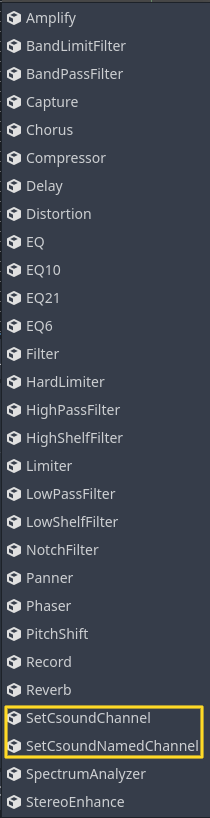
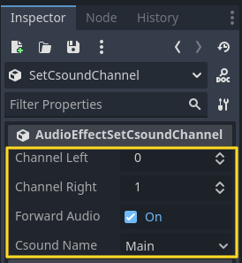
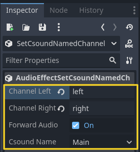

.. _doc_csound_audio_effects:

Csound Audio Effects
====================

Introduction
------------

Godot Csound provides several audio effects that can be applied to an audio bus, enabling audio signals from Godot to be processed by a Csound instance. This allows for advanced real-time audio manipulation, including effects such as reverb, filtering, and dynamic processing using Csound’s extensive synthesis and processing capabilities.

By routing audio through Csound, developers can leverage powerful audio transformations beyond Godot’s built-in effects.

AudioEffectSetCsoundChannel
---------------------------

`AudioEffectSetCsoundChannel` routes an audio bus signal to a specified Csound channel. This allows audio generated within Godot to be processed using Csound’s synthesis and effects engine.

Developers can use this to apply custom DSP (digital signal processing) techniques in Csound, such as distortion, granular synthesis, or convolution reverb, to a specific channel.

.. note::

    Each input channel should be assigned to only one audio effect to prevent conflicts and ensure correct audio routing.

AudioEffectSetCsoundNamedChannel
--------------------------------

`AudioEffectSetCsoundNamedChannel` functions similarly to `AudioEffectSetCsoundChannel`, but instead of routing audio to a numbered Csound channel, it sends the signal to a named Csound channel. This provides more flexibility in complex audio setups where named channels are preferred for organization and dynamic signal routing.

This feature is useful when working with multi-channel effects processing, dynamic mixing, or spatialized audio systems.

.. note::

    Like numbered channels, each named input channel should be assigned to only one audio effect to ensure proper functionality and avoid unintended audio conflicts.
