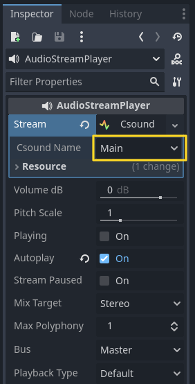
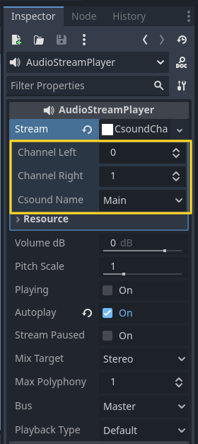
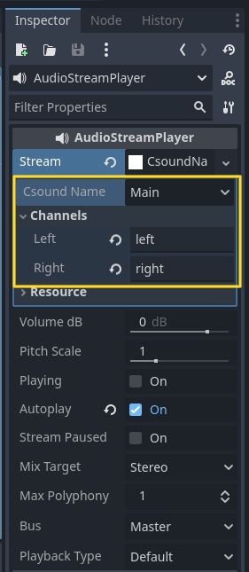

.. _doc_csound_audio_streams:

Csound Audio Streams
====================

Introduction
------------

As explained in :ref:`doc_audio_buses`, sound is routed to each bus using an `AudioStreamPlayer` node. There are different types of `AudioStreamPlayers`, each designed to load and play back a specific type of `AudioStream`.

Godot Csound provides multiple audio stream types, allowing for flexible audio routing and playback.

.. seealso::

    You may also be interested in reading about :ref:`doc_audio_streams`.

AudioStreamCsound
-----------------

`AudioStreamCsound` is responsible for driving audio generation in a Csound instance and outputting its sound. It plays audio from the first two channels of the assigned Csound instance, while additional channels can be accessed using `AudioStreamCsoundChannel`.  

A Csound instance will not produce sound unless an `AudioStreamCsound` is assigned to it.

.. note::

    Each `AudioStreamCsound` should be assigned to only one Csound instance.

AudioStreamCsoundChannel
------------------------

`AudioStreamCsoundChannel` allows access to specific output channels of a Csound instance. This stream lets you specify the Csound instance name and select which channel numbers to emit.  

An `AudioStreamCsound` is still required to generate the audio.

.. note::

    Each channel should be assigned to only one audio stream to ensure proper audio output.

AudioStreamCsoundNamedChannel
-----------------------------

`AudioStreamCsoundNamedChannel` provides access to named channels within a Csound instance. This stream allows specifying the Csound instance name and selecting named channels for audio output.  

An `AudioStreamCsound` is still required to generate the audio.

.. note::

    Like numbered channels, each named channel should be assigned to only one audio stream to maintain proper functionality.
