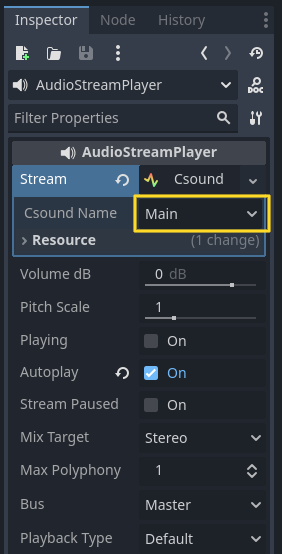

.. _doc_csound_instances:

Csound Instances
================

Introduction
------------

Godot Csound allows for the creation of multiple independent Csound instances, enabling complex audio synthesis and processing.

The Csound instance editor functions similarly to the Audio Bus. Users can create, remove, duplicate, and delete Csound instances as needed.

Csound Instances
----------------

Csound instances can be accessed at the bottom of the Godot editor:

A Csound instance acts as an audio generator. Each instance can have its own `.csd` file. While Csound instances generate audio, they are controlled by an `AudioStreamCsound` node. The first two channels of a Csound instance serve as the primary audio output. Additional channels can be accessed using `AudioStreamCsoundChannel`, while named channels can be accessed via `AudioStreamCsoundNamedChannel`. 

A channel should only be read by a single audio stream; if multiple audio streams read the same channel, the audio output may not be generated correctly.

Each Csound instance includes a VU meter (visual bars that light up when sound is produced), indicating the amplitude of the generated signal.

The leftmost Csound instance is the **Main Csound instance**. By default, other Godot Csound components will use this instance unless another instance is specified.

Adding a CSD File
------------------

Files with the following extensions (`.orc`, `.sco`, `.csd`, `.udo`, `.inc`) are automatically recognized as resources by Godot Csound. Once imported, a `.csd` file can be assigned to a specific Csound instance.

.. image:: img/csound_instance_csd.webp

Playing Audio Through a Bus
---------------------------

To generate audio using a Csound instance:

1. Create an `AudioStreamPlayer` node.
2. Load an `AudioStreamCsound`.
3. Assign a target bus for playback.

Finally, toggle the **Playing** property to **On**, and the sound will be generated based on the `.csd` file assigned to the Csound instance.

Clicking on the `AudioStreamPlayer` stream name will open the AudioStream settings, where the assigned Csound instance can be selected.

.. seealso::

    You may also be interested in reading about :ref:`doc_audio_buses`.

.. seealso::

    You may also be interested in reading about :ref:`doc_audio_streams`.

Csound Instance Management
--------------------------

`AudioStreamCsound` nodes use instance names to identify Csound instances. This allows instances to be added, removed, or rearranged without breaking references. However, if a Csound instance is renamed, any references to it will be lost, and the `AudioStreamCsound` will default to the **Main Csound instance**.

Default Csound Layout
----------------------

The default Csound layout is automatically saved to the `res://default_csound_layout.tres` file. Custom Csound configurations can be saved and loaded from disk as needed.
