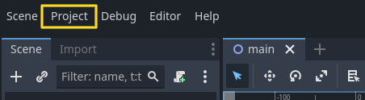
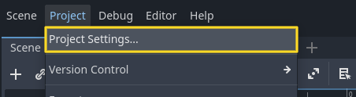
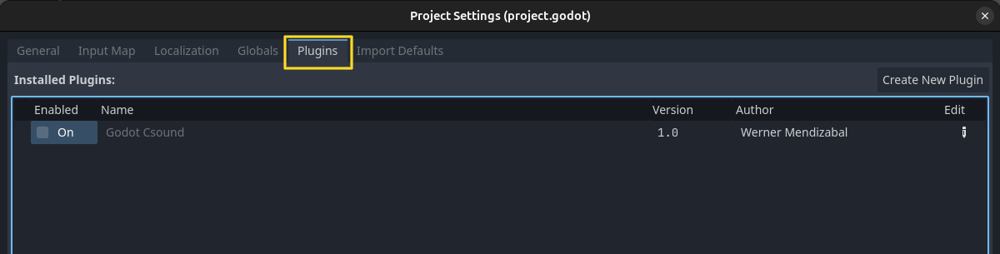
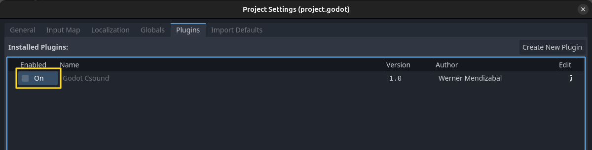

.. _doc_setup_csound:

Setup Csound
============

Introduction
------------

Godot Csound is a GDExtension that integrates Csound into Godot, enabling real-time sound synthesis within the engine.

Installation
------------

To install Godot Csound, follow these steps:

1. Visit the project's GitHub page: `Godot Csound <https://github.com/nonameentername/godot-csound>`_.
2. Navigate to the `Releases <https://github.com/nonameentername/godot-csound/releases>`_ section.
3. Download the latest release as a ZIP file.
4. Extract the contents into your Godot project directory.

Importing Resources
-------------------

After extracting the files, you need to import the Godot Csound resources. You can do this using either the command line or the Godot editor.

**Method 1: Using the Command Line**

Open a terminal and run the following command in your project directory:

.. code-block:: bash

    godot --headless --import

You can then start Godot using the following command:

.. code-block:: bash

    godot --editor

**Method 2: Using the Godot Editor**

1. Open your project in Godot.
2. Close the editor after it finishes importing the resources.
3. Reopen Godot.

Enabling the Plugin
-------------------

Once the resources are imported:

1. Open the Godot editor.
2. Navigate to **Project Settings**.

3. Under **Plugins**, locate `godot-csound`.

4. Enable the plugin.

Your project is now set up with Godot Csound!
